# Production-Ready Expense Reimbursement System Backend & AI Policy Assistant (RAG)

[](https://fastapi.tiangolo.com)
[](https://python.org)
[](https://www.sqlalchemy.org/)
[-brightgreen.svg)](https://pytest.org)
[](LICENSE)

A robust, enterprise-grade Expense Reimbursement System backend built using **FastAPI**, **SQLAlchemy ORM (2.0)**, **SQLite**, **Pydantic (v2)**, and an **AI-powered RAG Assistant**.

---

## 📸 Interactive API Screenshots & System Gallery

### 1. OpenAPI Documentation Header & Features (`/docs`)
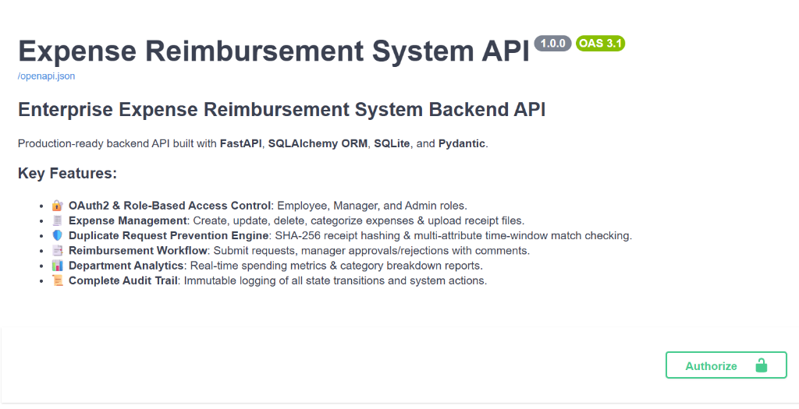

### 2. Interactive Endpoint Router Groups
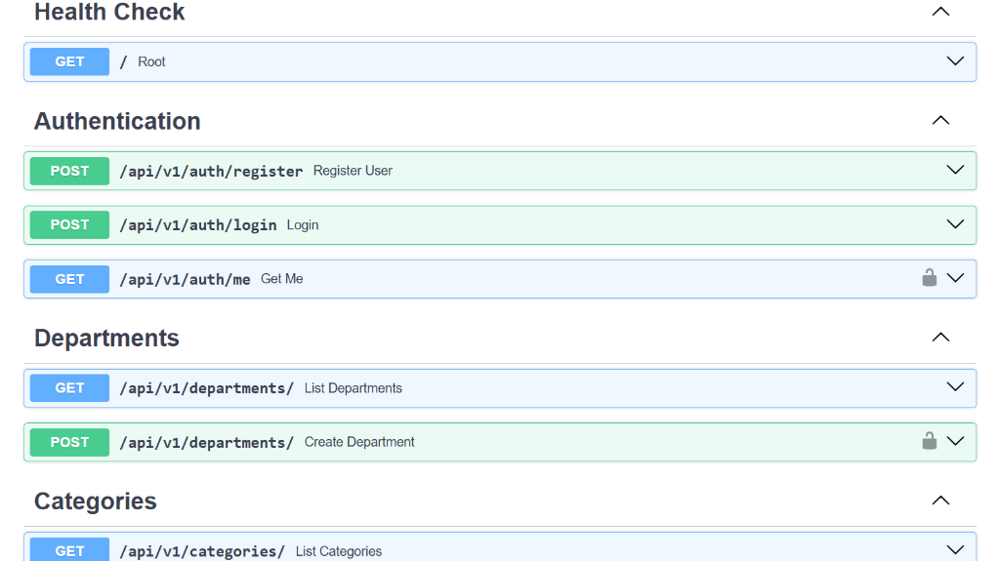

### 3. OAuth2 Authentication Modal & Login Flow
| OAuth2 Credentials Login Form | OAuth2 Authorized Session State |
|---|---|
| 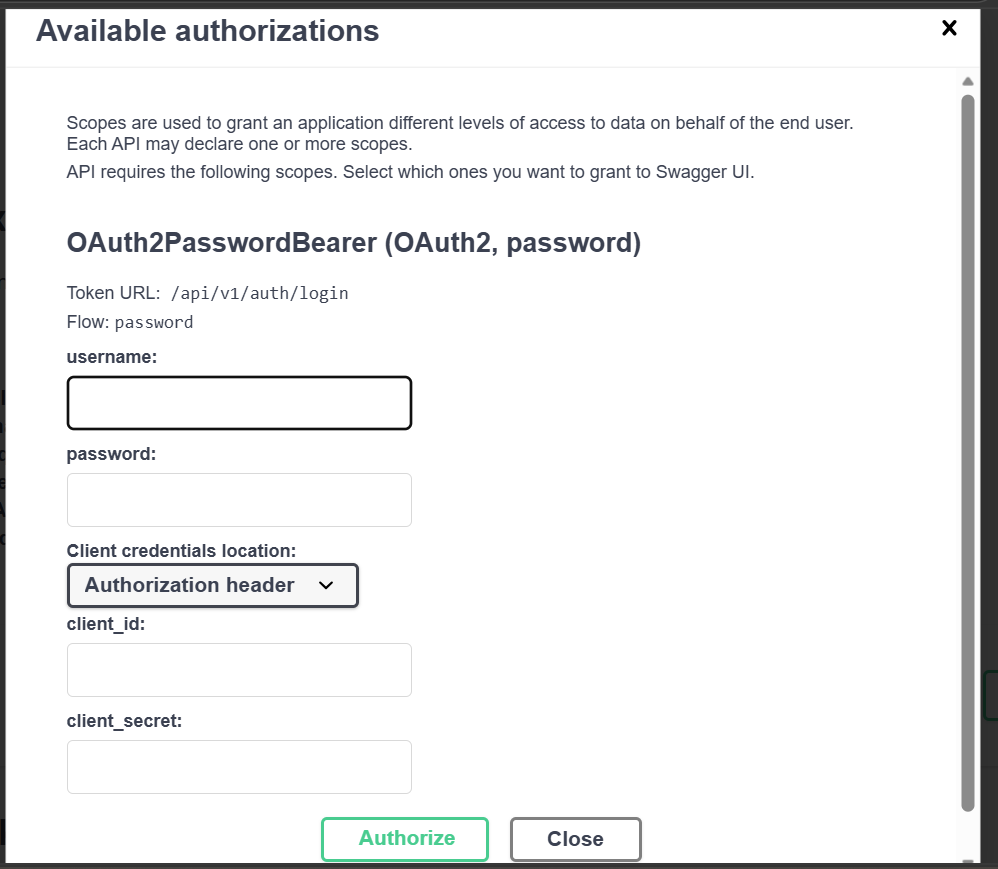 | 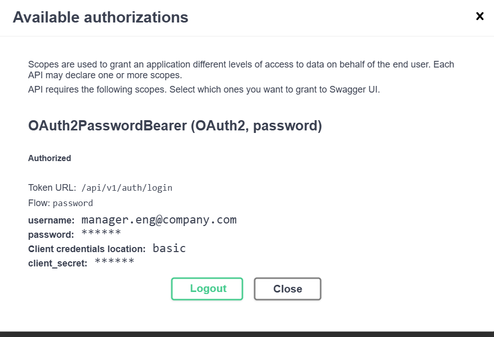 |

### 4. API Responses & Payloads
| User Profile Payload (`GET /api/v1/auth/me`) | Department Summary Payload (`GET /api/v1/departments/`) |
|---|---|
| 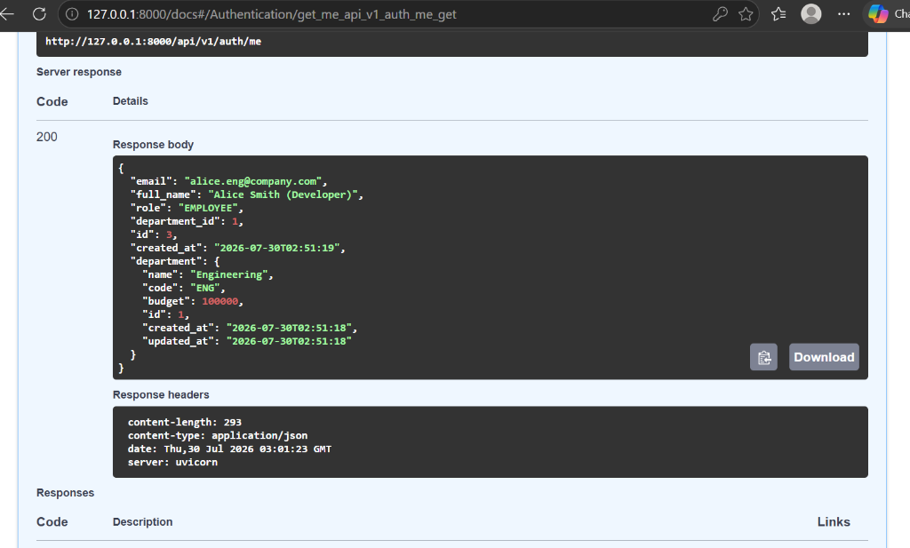 | 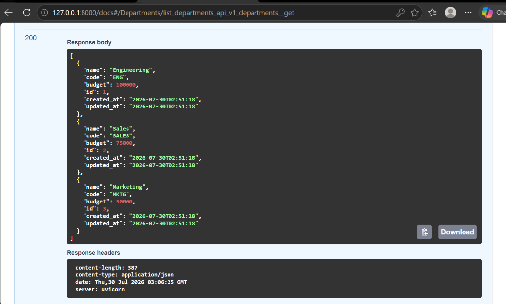 |

### 5. System Health Check Endpoint (`GET /`)
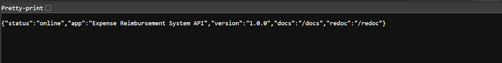

---

## 🧪 CLI Setup & Automated Test Suite

### 1. Database Seeder Script Execution (`seed_data.py`)
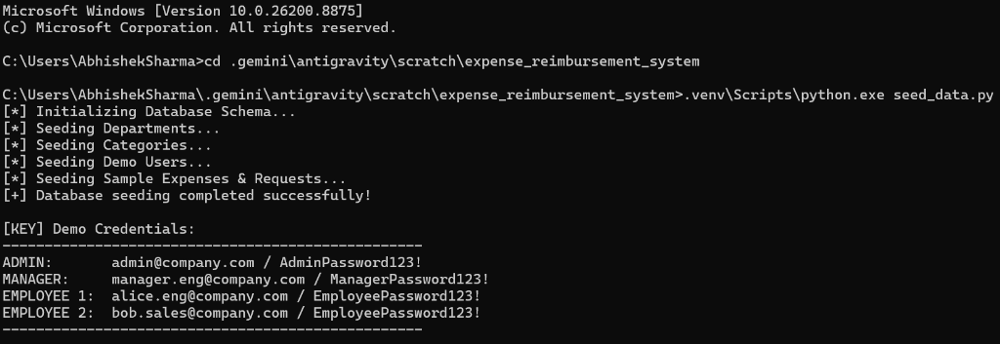

### 2. Automated Test Suite Execution (`pytest -v`)
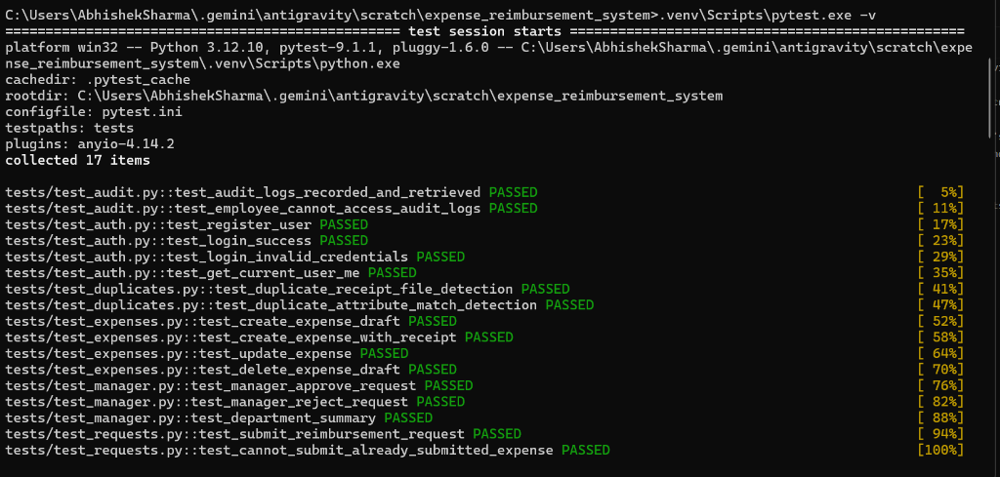

---

## 🏛️ System Architecture Overview

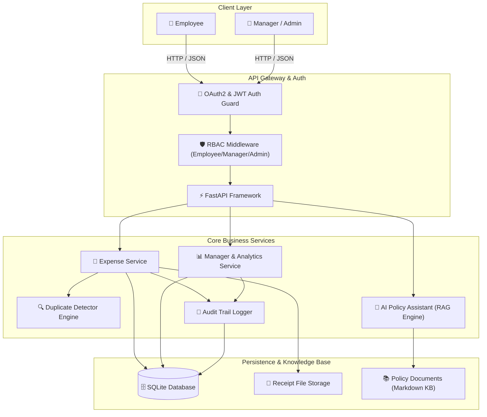

---

## 🔄 Expense Reimbursement & Duplicate Prevention Flow

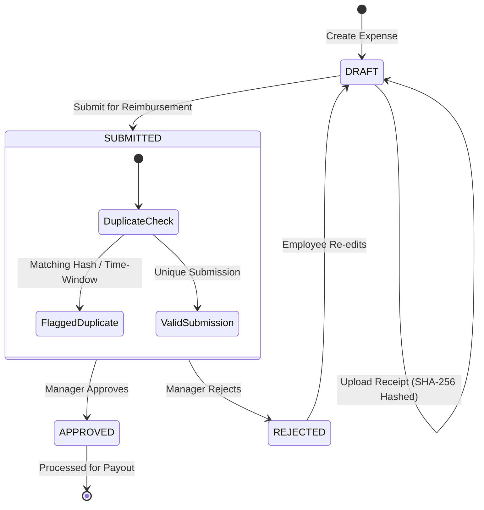

---

## 🤖 AI Policy Assistant (RAG Architecture)

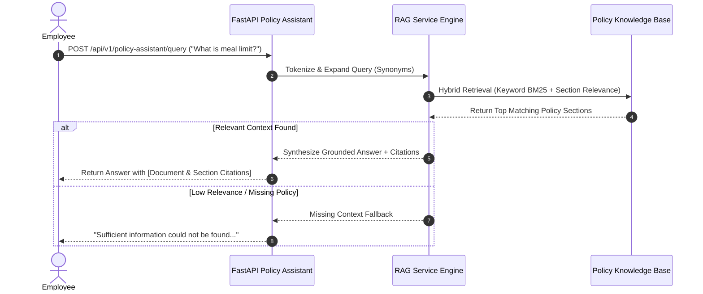

---

## ✨ Key Features

- **🔐 OAuth2 Authentication & Role-Based Access Control (RBAC)**: Secure JWT token authentication with role enforcement (`EMPLOYEE`, `MANAGER`, `ADMIN`).
- **🤖 RAG-Powered AI Policy Assistant**:
  - Processes and indexes corporate policy documents (`Expense Policy`, `Travel Policy`, `Finance Policy`, `Employee Handbook`).
  - **Hybrid Search**: Combines sparse keyword matching and dense token similarity.
  - **Document Citations**: Includes explicit policy document and section citations with every answer.
  - **Query Expansion**: Synonym expansion for natural language query variations.
  - **Metadata Filtering**: Option to scope query search to specific policy documents.
  - **Missing Information Fallback**: Explicitly states when information is unavailable rather than hallucinating.
  - **Streaming Responses**: Token streaming endpoint via Server-Sent Events (SSE).
- **🧾 Comprehensive Expense Management**: Create, update, delete, search, filter, and categorize expenses with receipt file attachments.
- **🛡️ Multi-Tier Duplicate Prevention Engine**: Cryptographic SHA-256 receipt hashing, exact attribute matching, and time-window heuristic overlap checks (±3 days).
- **📑 Manager Approval Workflow**: Real-time review queue, approve/reject actions with comments, and state transition enforcement.
- **📊 Department Analytics & Summaries**: Real-time aggregation of department budgets, approved/pending/rejected totals, and category breakdowns.
- **📜 Complete Immutable Audit Trail**: Detailed audit logging for all mutations with JSON diffs and actor tracking.

---

## 📋 Policy Documents Indexed

1. **`Expense Policy`**: Receipts rules, categories ($75 meal cap, $300 team dinner limit, $500 hardware limit).
2. **`Travel Policy`**: 14-day advance booking, economy class, 8-hour flight business class exception, hotel caps ($250 standard / $400 tier-1 cities).
3. **`Finance Policy`**: 30-day submission deadline, approval hierarchy ($1k manager / $5k director / >$5k VP & CFO), 5-day direct deposit SLA.
4. **`Employee Handbook`**: Working hours, remote stipend ($500 setup + $50 monthly internet), continuing education allowance ($1,500/yr), wellness benefit ($50/mo).

---

## 🔌 API Endpoints Summary

| Category | Method | Endpoint | Description |
|---|---|---|---|
| **AI Policy Assistant** | `POST` | `/api/v1/policy-assistant/query` | RAG query with grounded answer & citations |
| **AI Policy Assistant** | `POST` | `/api/v1/policy-assistant/stream` | Real-time streaming RAG answer response |
| **AI Policy Assistant** | `GET`  | `/api/v1/policy-assistant/documents` | List indexed policy documents and sections |
| **Auth** | `POST` | `/api/v1/auth/register` | Register new user |
| **Auth** | `POST` | `/api/v1/auth/login` | OAuth2 token login |
| **Auth** | `GET`  | `/api/v1/auth/me` | Current user profile |
| **Expenses** | `GET`  | `/api/v1/expenses/` | List, search & filter expenses (paginated) |
| **Expenses** | `POST` | `/api/v1/expenses/` | Create expense draft (with receipt file) |
| **Expenses** | `POST` | `/api/v1/expenses/{id}/receipt` | Upload receipt image or PDF |
| **Expenses** | `PUT`  | `/api/v1/expenses/{id}` | Update draft or rejected expense |
| **Expenses** | `DELETE` | `/api/v1/expenses/{id}` | Delete draft expense |
| **Requests** | `POST` | `/api/v1/requests/submit` | Submit expense for reimbursement review |
| **Requests** | `GET`  | `/api/v1/requests/my-requests` | Track employee request status |
| **Manager** | `GET`  | `/api/v1/manager/pending-requests` | View pending requests for department |
| **Manager** | `POST` | `/api/v1/manager/requests/{id}/review` | Approve/Reject request with comments |
| **Manager** | `GET`  | `/api/v1/manager/department-summary/{id}` | Department analytics & budget breakdown |
| **Audit** | `GET`  | `/api/v1/audit-logs/` | Query immutable audit log history |

---

## ⚡ Quickstart Guide

### 1. Environment Setup

```bash
cd expense_reimbursement_system
python -m venv .venv

# Activate venv:
.venv\Scripts\activate      # Windows
source .venv/bin/activate    # Linux/macOS

pip install -r requirements.txt
```

### 2. Seed Database

```bash
python seed_data.py
```

### 3. Run Automated Tests (22 Passed)

```bash
pytest -v
```

### 4. Launch Application Server

```bash
uvicorn app.main:app --reload --port 8000
```

- **Interactive Swagger Docs**: `http://127.0.0.1:8000/docs`
- **ReDoc Documentation**: `http://127.0.0.1:8000/redoc`
