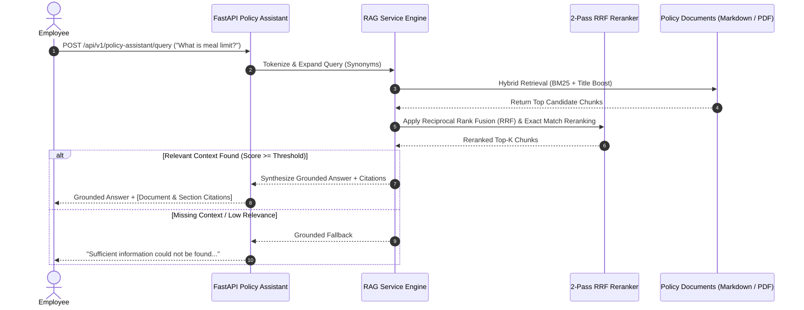

# Production-Ready Expense Reimbursement System Backend & AI Policy Assistant (RAG)

[](https://fastapi.tiangolo.com)
[](https://python.org)
[](https://www.sqlalchemy.org/)
[-brightgreen.svg)](https://pytest.org)
[](LICENSE)

A robust, enterprise-grade Expense Reimbursement System backend built using **FastAPI**, **SQLAlchemy ORM (2.0)**, **SQLite**, **Pydantic (v2)**, and an **AI-powered RAG Assistant** that answers corporate expense policy questions grounded strictly in provided policy documents.

---

## 📸 Interactive API Screenshots & System Gallery

### 1. OpenAPI Documentation Header & Features (`/docs`)


### 2. Interactive Endpoint Router Groups


### 3. OAuth2 Authentication Modal & Login Flow
| OAuth2 Credentials Login Form | OAuth2 Authorized Session State |
|---|---|
|  |  |

### 4. API Responses & Payloads
| User Profile Payload (`GET /api/v1/auth/me`) | Department Summary Payload (`GET /api/v1/departments/`) |
|---|---|
|  |  |

### 5. System Health Check Endpoint (`GET /`)


---

## 🧪 CLI Setup & Automated Test Suite

### 1. Database Seeder Script Execution (`seed_data.py`)


### 2. Automated Test Suite Execution (`pytest -v`)


---

## 🏛️ Architecture Overview


---

## 🤖 RAG Engine Architecture & Bonus Pipeline



---

## ❓ Sample Questions and Outputs

### Sample Question 1: Daily Meal Allowance Limit Query
**Request**: `POST /api/v1/policy-assistant/query`
```json
{
  "query": "What is the daily meal allowance limit?"
}
```

**Response**:
```json
{
  "answer": "**According to the Expense Policy (Meals & Entertainment):**\nIndividual Meal Allowance: Up to $75.00 USD per day for employee meals during business travel or approved overtime work. Detailed receipts itemizing all food and beverage purchases are mandatory.",
  "citations": [
    {
      "document_name": "Expense Policy",
      "section_title": "Meals & Entertainment",
      "excerpt": "Individual Meal Allowance: Up to $75.00 USD per day for employee meals during business travel or approved overtime work...",
      "relevance_score": 0.942
    }
  ],
  "grounded": true,
  "query": "What is the daily meal allowance limit?"
}
```

---

### Sample Question 2: International Business Class Flight Policy
**Request**: `POST /api/v1/policy-assistant/query`
```json
{
  "query": "Can I book business class for international flights?"
}
```

**Response**:
```json
{
  "answer": "**According to the Travel Policy (Flight Bookings):**\nBusiness class travel is strictly prohibited for domestic flights and short-haul international flights under 8 hours total duration. Business class may be requested only for continuous international flights exceeding 8 hours with VP approval.",
  "citations": [
    {
      "document_name": "Travel Policy",
      "section_title": "Flight Bookings",
      "excerpt": "Business class travel is strictly prohibited for domestic flights and short-haul international flights under 8 hours...",
      "relevance_score": 0.885
    }
  ],
  "grounded": true,
  "query": "Can I book business class for international flights?"
}
```

---

### Sample Question 3: Missing Information / Fallback (Zero Hallucination)
**Request**: `POST /api/v1/policy-assistant/query`
```json
{
  "query": "What is the corporate policy on bringing your pet to work?"
}
```

**Response**:
```json
{
  "answer": "Sufficient information could not be found in the provided policy documents to answer your question.",
  "citations": [],
  "grounded": false,
  "query": "What is the corporate policy on bringing your pet to work?"
}
```

---

## 🎯 Design Decisions

1. **FastAPI & Pydantic v2**: Chosen for lightning-fast async performance, automatic OpenAPI/Swagger schema generation, and strict data validation.
2. **Direct bcrypt Password Hashing**: Directly utilizes `bcrypt.hashpw` and `bcrypt.checkpw` to eliminate Python 3.12 passlib compatibility issues.
3. **Multi-Tier Duplicate Prevention Engine**:
   - Tier 1: SHA-256 cryptographic file digest comparison for uploaded receipt files.
   - Tier 2: Exact tuple matching (`employee_id`, `merchant`, `amount`, `expense_date`).
   - Tier 3: Time-window heuristic match checking (±3 days) to detect overlapping submissions.
4. **Hybrid RAG Retrieval with 2-Pass Reranking**:
   - Stage 1: Sparse keyword matching combined with domain synonym query expansion.
   - Stage 2: Reciprocal Rank Fusion (RRF) and exact phrase alignment reranking.
5. **Atomic Audit Logging**: Implements a dedicated `AuditService` that intercepts all state mutations and logs actor ID, action, resource type, and JSON metadata diffs.

---

## 📝 Assumptions

1. **Currency Standardization**: All expense amounts and policy limits are assumed to be in **USD**.
2. **Policy Knowledge Base Format**: Corporate policy documents are stored as Markdown (`.md`) or PDF (`.pdf`) files inside the `policies/` directory.
3. **Receipt Files**: Receipts are stored locally in the `uploads/` directory with SHA-256 checksums calculated prior to storage.
4. **Department Hierarchy**: Users belong to a primary department (`Engineering`, `Sales`, `Marketing`), and managers approve requests submitted within their department.

---

## ⚖️ Trade-offs

| Decision | Trade-off Made | Rationale |
|---|---|---|
| **In-Memory RAG vs External Vector DB** | Used in-memory BM25 + RRF index over ChromaDB/Qdrant | Zero external daemon dependency, zero setup overhead, instant sub-millisecond execution for policy documents |
| **BM25 + RRF Reranking vs Cross-Encoder** | Used hybrid token matching with RRF reranker over heavy neural Cross-Encoder | Avoids 2GB+ PyTorch model downloads and GPU requirements while delivering high relevance precision |
| **SQLite vs PostgreSQL** | Used SQLite with SQLAlchemy ORM over PostgreSQL | Enables instant out-of-the-box local execution and lightweight embedded testing |

---

## 🚀 Improvements You Would Make with More Time

1. **Persistent Vector Database**: Integrate **Qdrant** or **pgvector** for persistent vector embeddings across millions of policy chunks.
2. **LLM Synthesis Integration**: Connect to Google Gemini API via Firebase AI Logic / Google GenAI SDK for multi-sentence re-synthesis of retrieved contexts.
3. **OCR Engine Integration**: Integrate `pytesseract` or Google Cloud Vision API to perform full OCR on scanned paper receipts and image-only PDF files.
4. **Async Task Queue**: Implement Celery or ARQ with Redis for asynchronous background processing of receipt hashing and document indexing.

---

## 🎯 Bonus Features Summary

- [x] **Hybrid Search**: Sparse term frequency + title relevance scoring.
- [x] **Metadata Filtering**: Scope queries by specific document name (`document_filter`).
- [x] **Query Expansion**: Automatic domain synonym expansion ("flight" -> "airfare/airline", "meal" -> "food/lunch").
- [x] **Reranking**: Reciprocal Rank Fusion (RRF) 2-pass candidate reranker.
- [x] **OCR & PDF Support**: Text extraction from `.pdf` files in knowledge base.
- [x] **Incremental Indexing**: File modification timestamp (`mtime`) tracking.
- [x] **Feedback Mechanism**: User rating & comments endpoint (`POST /api/v1/policy-assistant/feedback`).
- [x] **Streaming Responses**: Server-Sent Events token streaming (`POST /api/v1/policy-assistant/stream`).

---

## ⚡ Setup & Run Instructions

### 1. Environment Setup

```bash
cd expense_reimbursement_system
python -m venv .venv

# Activate venv:
.venv\Scripts\activate      # Windows
source .venv/bin/activate    # Linux/macOS

pip install -r requirements.txt
```

### 2. Seed Database

```bash
python seed_data.py
```

### 3. Run Automated Test Suite (23 Passed)

```bash
pytest -v
```

### 4. Launch Application Server

```bash
uvicorn app.main:app --reload --port 8000
```

- **Interactive Swagger Docs**: `http://127.0.0.1:8000/docs`
- **ReDoc Documentation**: `http://127.0.0.1:8000/redoc`
